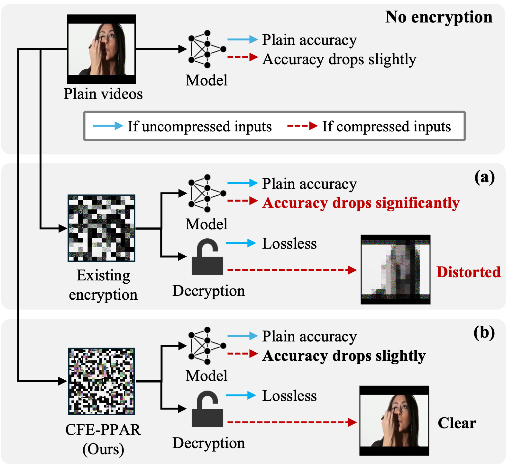
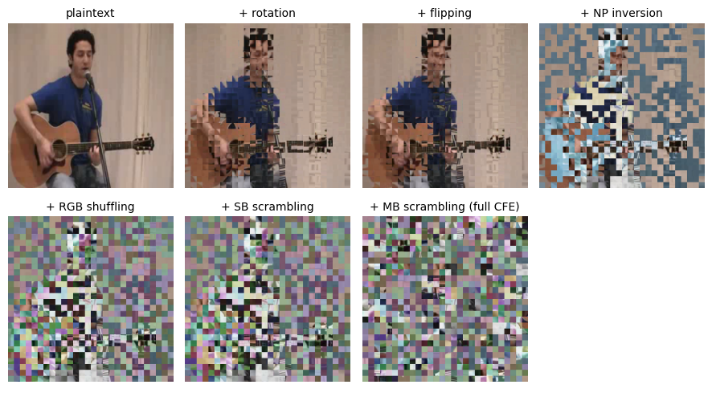
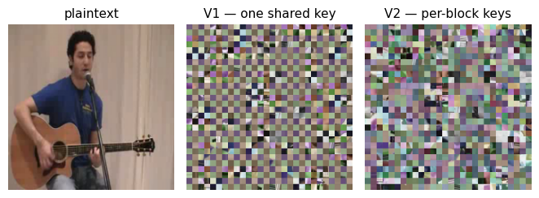
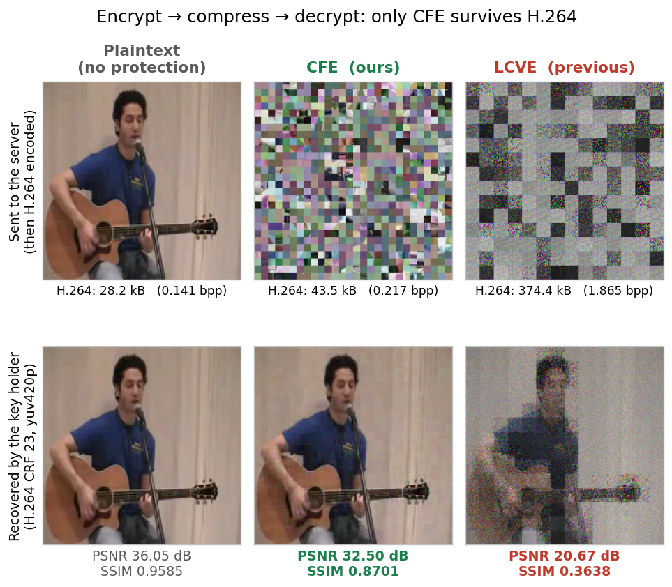

<div align="center">

# CFE-PPAR: Compression-Friendly Encryption for Privacy-Preserving Action Recognition Leveraging Video Transformers

<p>
  <b>Haiwei Lin</b><sup>1</sup>&emsp;
  <b>Shoko Imaizumi</b><sup>1</sup>&emsp;
  <b>Hitoshi Kiya</b><sup>2</sup>
</p>

<p>
  <sup>1</sup>Chiba University&emsp;
  <sup>2</sup>Tokyo Metropolitan University
</p>

<p><i>IEEE International Conference on Image Processing (ICIP), 2026</i></p>

<p>
  <a href="https://ieeexplore.ieee.org/document/11630024">
    </a>
  <a href="https://doi.org/10.1109/ICIP61757.2026.11630024">
    </a>
  <a href="https://arxiv.org/abs/2605.05692">
    </a>
  
  <a href="LICENSE">
    </a>
</p>

<br>



<p><em>Utility of encryption-based methods before and after compression. (a) Previous method. (b) Ours.</em></p>

</div>

## Abstract

Encryption-based privacy-preserving action recognition (PPAR) protects visual content well, but recognition accuracy and visual quality collapse once the encrypted video is compressed — previous methods are **not compression-friendly**. We propose the first compression-friendly encryption for PPAR: videos encrypted with secret keys are recognized **directly** by a video transformer whose parameters are transformed with the same keys. CFE-PPAR outperforms previous methods on UCF101 and HMDB51 under Motion-JPEG and H.264. Full paper: [IEEE Xplore](https://ieeexplore.ieee.org/document/11630024) (published version) · [arXiv](https://arxiv.org/abs/2605.05692) (open access).

## What's Here

The **official implementation** of the paper, released by its authors — the training-free core of the method:

| File | Role |
| --- | --- |
| [`compression_friendly_encryption.py`](compression_friendly_encryption.py) | **CFE** — block-wise encryption (Sec. 3.2) and its inverse |
| [`key_dependent_domain_adaptation.py`](key_dependent_domain_adaptation.py) | **KDDA** — transforms the transformer's parameters with the same keys (Sec. 3.3) |
| [`verify_consistency.py`](verify_consistency.py) | checks that encrypted-domain inference matches plaintext |
| [`visualized_demo.ipynb`](visualized_demo.ipynb) | walks through each encryption step |

Everything runs out of the box on the **Kinetics-400 pretrained** ViViT, downloaded on first use — no GPU and no dataset needed. The clips in `samples/` are a *PlayingGuitar* video from [UCF101](https://www.crcv.ucf.edu/data/UCF101.php), preprocessed to 32 frames at 224×224; please cite the dataset if you use them.

> **Scope.** This demonstrates the method and the plaintext/encrypted consistency, not the full benchmark — the UCF101 / HMDB51 tables need fine-tuning (Sec. 4), which is not included.
>
> **Note.** This is the authors' own release; the research code was refactored and documented **with the help of AI tooling** for clarity and reproducibility. The behavior is unchanged and verified, but **if you hit an unexpected bug, please open an [issue](../../issues) — feedback is welcome.**

## Installation

```bash
git clone https://github.com/importLin/CFE.git
cd CFE
pip install -r requirements.txt
```

Tested with Python 3.11. The ViViT checkpoint (~350 MB) downloads on first run; for GPU, install a CUDA-matched PyTorch from [pytorch.org](https://pytorch.org/get-started/locally/) first.

## Usage

### 1. Encrypt

```bash
python compression_friendly_encryption.py --input samples/plain_1.avi --seed 1 --variant V2
```

Writes `samples/encrypted_V2.avi`. `--seed` sets the secret keys; `--variant` picks `V1` (one shared key) or `V2` (per-block keys, the default). Any input works — clips are auto-preprocessed to 32 frames at 224×224. Pre-encrypted clips already ship with the repo, so you can skip straight to step 2.

### 2. Verify consistency

```bash
python verify_consistency.py --seed 1 --variant V2
```

`--seed` and `--variant` **must match** step 1. Abridged output:

```text
CFE-PPAR consistency check   [device=cuda  dtype=float32  variant=V2]

1) PREDICTION  (does the encrypted-domain VT predict the same action?)
   plaintext  top-1: LABEL_335  (id 335)
   encrypted  top-1: LABEL_335  (id 335)
   -> top-1 match: True   top-5 order match: True

3) INFERENCE COST  (wall-clock, averaged over 3 steady-state runs)
   extra cost of running on cipher :     +6.6 ms  (+4.9%, 1.05x)

VERDICT: CONSISTENT  (encrypted-domain inference matches plaintext)
```

What matters is that the two predictions **match**; class names read as `LABEL_<id>` because this checkpoint ships without a Kinetics-400 label map. Add `--dtype float64` for bit-exact equivalence, or `--device cpu` to force CPU.

### 3. Decrypt (optional)

```bash
python compression_friendly_encryption.py --decrypt --seed 1 --variant V2
```

Recognition never needs this — the adapted transformer reads the ciphertext directly and the server holds no keys. It is for the key holder, and it shows the cipher is lossless: every step is a permutation or a sign flip.

### 4. Visualize (optional)

```bash
jupyter notebook visualized_demo.ipynb
```

## How It Works

Two training-free components (Sec. 3).

**CFE (encryption).** Each frame is cut into 16×16 main-blocks, each into 8×8 sub-blocks. Five sub-block transforms — rotation, flipping, negative-positive inversion, RGB-channel shuffling, sub-block scrambling — are applied with key `K_ST`, then main-blocks are scrambled with `K_MS`. Crucially every transform stays **inside** a 16×16 block, so neighboring pixels stay correlated — that is what keeps the ciphertext compressible.

<div align="center">

<p><em>CFE applied cumulatively: plaintext → the five sub-block transforms (A.3) → main-block scrambling (A.4). The last panel is the frame that leaves the client.</em></p>
</div>

**KDDA (model adaptation).** The same keys transform the transformer's cube-embedding layer — the 3D conv kernel gets the sub-block transforms, the positional embeddings are rearranged — canceling the encryption. The transformer then recognizes encrypted video directly, with no fine-tuning and no architectural change.

**V1 vs V2.** `V1` shares one key across all main-blocks, `V2` uses a per-block key. Both hide the content and preserve accuracy; `V2` resists reconstruction attacks better (Sec. 4.5).

<div align="center">

<p><em>Full CFE under the two key schemes, same frame and seed.</em></p>
</div>

## Under Compression

Encrypted video travels over the same pipes as any other video, so it gets compressed — and that is where previous methods break down. Running the full path **encrypt → H.264 → decode → decrypt** on the sample clip, against [LCVE](https://openaccess.thecvf.com/content/WACV2024/html/Ishikawa_Learnable_Cube-Based_Video_Encryption_for_Privacy-Preserving_Action_Recognition_WACV_2024_paper.html) (WACV 2024) and against compressing the plaintext itself as the ceiling:

<div align="center">

<p><em>Top: what leaves the client, then H.264-encoded. Bottom: what the key holder gets back. CFE keeps pixels correlated so the codec still works; LCVE scatters them, so the codec is fed noise.</em></p>
</div>

## Security Notes

The threat model targets ciphertext-only attacks; a one-time key policy (unique keys per video) mitigates known- and chosen-plaintext attacks. As a block-wise scheme it can be vulnerable to jigsaw-puzzle-solver attacks — `V2` is more robust than `V1` uncompressed, and lossy compression further hinders reconstruction (Sec. 4.5). This is a research prototype, not a production cryptosystem; key derivation uses a fast, non-cryptographic mixer for reproducibility.

## Citation

```bibtex
@inproceedings{lin2026cfe,
  title={{CFE-PPAR}: Compression-Friendly Encryption for Privacy-Preserving Action Recognition Leveraging Video Transformers},
  author={Lin, Haiwei and Imaizumi, Shoko and Kiya, Hitoshi},
  booktitle={2026 IEEE International Conference on Image Processing (ICIP)},
  pages={1--6},
  year={2026},
  doi={10.1109/ICIP61757.2026.11630024}
}
```

## License

Released under the [MIT License](LICENSE).
